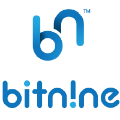

[ENGLISH](./README.md)

[](https://bitnine.net/)


# AgensViewer &middot; [](http://makeapullrequest.com)
AgensViewer는 Agens 제품군의 그래프 시각화 도구입니다.

- Getting Started


## 1. Getting Started
AgensViewer는 Javascript 기반의 프로젝트이며, 종속성으로 Node.js를 사용합니다. 로컬 개발 환경을 사용하여 빠르게 시작하고, 실행할 수 있습니다.

우선적으로 기동을 위해서는 Node.js와 Yarn ( 혹은,  NPM 같은 다른 패키지 매니저 )이 필요합니다.

- macOS: `brew install node`
- Windows: `choco install nodejs`
- Ubuntu: `apt install nodejs npm`


공식 Node.js 설치 가이드 : https://nodejs.org/ko/download/


#### 초기 개발 환경 구동

AgensViewer는 Database와 통신하기 위하여 Web Browser에서 처리하지 못하는 기능을 수행하기 위하여, Back-end와 Front-end로 구성됩니다.

Back-end는 Express.js 기반으로 Database의 Connection을 관리하고, Front-end에서 발생하는 이벤트를 처리하도록 개발되어 있으며, Front-end는 React.js 기반으로 사용자에게 렌더링 하는 것에 초점이 이루어져 있습니다.

```
npm install
cd frontend && npm install
cd ..
cd backend && npm install

npm run start
```


#### 배포

React.js 기반인 Front-end를 빌드하면, 한개의 HTML 파일과 여러개의 JS / CSS 의 형태의 파일들이 생성됩니다.

생성되는 한개의 HTML 파일이 entry 가 되며, HTML5의 History API를 이용하여, 페이지 주소가 이동한 것처럼 동작하게 됩니다.

그리하여, nginx나 express 등 해당 파일을 호스팅할 경우 JS와 CSS 가 아닐 경우는 모두 HTML로 호스팅되도록 설정해야 합니다.

```
npm install
cd frontend && yarn build
# frontend 폴더에 build 폴더로 HTML/CSS/JS가 생성됩니다.
cd ..
cd backend && npm run start
```